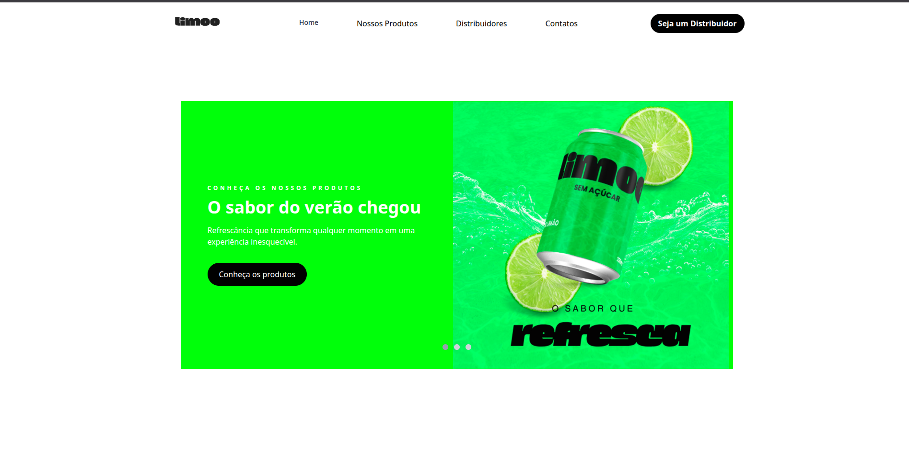

# Limoo - Landing Page

Landing Page desenvolvida para a **Limoo**, marca fictícia de refrigerante sabor limão. O projeto foi construído com foco em um design moderno, responsivo e alinhado à identidade visual vibrante da marca.

## Tecnologias Utilizadas

- **HTML5** - estruturação semântica do conteúdo
- **CSS3** - responsividade, e estilização
- **Talwind CSS** - estilização utilitária e resposividade
- **JavaScript** - interatividade (carrosel do home, busca de distribuidores, integração com o mapa)

## Funcionalidades 

- **Header fixo** com navegação (Home, Nossos Produtos, Distribuidores, Contatos) e CTA "Seja um Distribuidor".
- **Home Section**  com carrosel/slider de destaque do produto.
- **Seção de Produtos** com apresentação das latas Limoo.
- **Seção de Distribuidores** com busca e mapa interativo (Leaflet/ OpenStreetMap) exibindo a localização.
- **Footer completo**  com links instucionais (Sobre Nós, Ajuda, Legal) e icones de redes sociais (Facebook, Instagram Linkedin, TikTok).
- |**Design  100% Resposivo**, constrído com a classes utilitários do Talwind CSS e CSS3.

# Mapa de Distribuidores

A seção de distribuidores utiliza o [Leaflet.js](https://leafletjs.com/) em conjunto com dados do [OpenStreetMap](https://www.openstreetmap.org/) para exibir a localização dos pontos de distribuição da marca.

